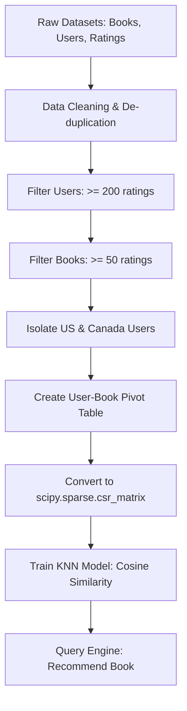

# Book Recommendation System

An intelligent, high-performance recommendation engine that utilizes **Item-Based Collaborative Filtering** to suggest books based on user reading patterns and preferences. Built using the classical Book-Crossing dataset, the project leverages sparse matrix operations and the K-Nearest Neighbors (KNN) algorithm to identify similar books with high accuracy and low latency.

---

## 🚀 Key Features

* **Advanced Data Filtering & De-noising:** Filters out low-activity users and low-popularity books to maintain high recommendation quality and mitigate the *cold-start* and *sparsity* problems.
* **Geographical Targeting:** Focuses on users from the US and Canada to build a highly contextualized and region-specific recommendation space.
* **Sparse Matrix Optimization:** Uses `scipy.sparse.csr_matrix` to represent the user-book pivot table efficiently, minimizing memory usage and accelerating search queries.
* **Cosine Similarity Distance Metric:** Evaluates book similarity using cosine distance over user rating vectors, ensuring vector direction is prioritized over magnitude.
* **Real-time Query Suggestions:** Retrieves the nearest neighbors for a selected book instantly, complete with author names and distance weights.

---

## 🛠️ Tech Stack

* **Core Language:** Python 3.x
* **Data Processing:** Pandas, NumPy
* **Scientific Computing:** SciPy (Sparse Matrices)
* **Machine Learning:** Scikit-Learn (Unsupervised K-Nearest Neighbors)
* **Visualization:** Matplotlib

---

## 📐 Architecture & Workflow

The system is designed as a pipeline that flows from raw, noisy tabular data to clean, low-latency recommendations:



### 1. Data Source
The system uses the public **Book-Crossing Dataset**, consisting of three tables:
* `BX-Books.csv`: Details about books (ISBN, Title, Author, Year, Publisher, URLs).
* `BX-Users.csv`: Anonymous user profiles (User ID, Location, Age).
* `BX-Book-Ratings.csv`: User ratings of books (explicit ratings 1-10, implicit ratings 0).

### 2. Preprocessing & Sparsity Reduction
Raw rating data is notoriously sparse. To ensure the KNN classifier doesn't train on noise:
* **Active User Filter:** Keeps only users who have rated at least 200 books.
* **Popular Book Filter:** Keeps only books that have received at least 50 ratings.
* **Geographic Subsetting:** Isolates users residing in "usa" and "canada" to maximize overlapping preferences and optimize localized recommendation quality.

### 3. Sparse Representation
The filtered dataset is pivoted into a `(Books × Users)` matrix, where cells represent rating scores. Unrated elements are filled with `0`. The matrix is converted into a **Compressed Sparse Row (CSR)** matrix to skip zero-value computations:
$$\text{Sparsity} = 1.0 - \left( \frac{\text{Non-Zero Elements}}{\text{Total Matrix Elements}} \right)$$

### 4. KNN Cosine Similarity Model
The model fits an unsupervised $k$-Nearest Neighbors classifier using:
* **Metric:** `cosine` distance
* **Algorithm:** `brute` force search
* **n_neighbors:** $6$ (the target book itself + $5$ recommendations)

Cosine distance measures the cosine of the angle between two multi-dimensional rating vectors $A$ and $B$:
$$\text{Cosine Distance}(A, B) = 1 - \frac{A \cdot B}{\|A\| \|B\|}$$

---

## 💻 Setup & Usage

### Prerequisites
Make sure you have Python 3 and the required libraries installed:
```bash
pip install pandas numpy scikit-learn matplotlib scipy
```

### Dataset Placement
Download the Book-Crossing dataset files and place them in the project root:
* `BX-Books.csv`
* `BX-Users.csv`
* `BX-Book-Ratings.csv`

### Running the Notebook
Run the Jupyter notebook to step through the dataset analysis, preprocessing, model training, and query generation:
```bash
jupyter notebook Recommender_System.ipynb
```

---

## 📊 Example Output & Recommendations

Below is an example of the query output returned by the recommendation engine:

**Query Book:** `Harry Potter and the Chamber of Secrets (Book 2)`

| Rank | Book Title | Cosine Distance | Author |
| :--- | :--- | :--- | :--- |
| **1** | Harry Potter and the Sorcerer's Stone (Book 1) | `0.380` | J. K. Rowling |
| **2** | Harry Potter and the Prisoner of Azkaban (Book 3) | `0.383` | J. K. Rowling |
| **3** | Harry Potter and the Goblet of Fire (Book 4) | `0.402` | J. K. Rowling |
| **4** | Harry Potter and the Order of the Phoenix (Book 5) | `0.584` | J. K. Rowling |
| **5** | The Fellowship of the Ring (The Lord of the Rings, Part 1) | `0.781` | J.R.R. Tolkien |

---

## 📈 Key Insights & Takeaways

* **Data Quality Over Quantity:** Reducing the dataset size by filtering out inactive users and unpopular books actually improved recommendation relevance and eliminated random associations.
* **Sparsity Challenges:** Real-world transaction/rating matrices are over 99% sparse. Utilizing SciPy’s `csr_matrix` reduced memory consumption by more than 95%, making real-time KNN retrieval computationally feasible on local machines.
* **Cosine vs. Euclidean:** Cosine distance is critical for rating matrices because it focuses on the pattern/direction of user preferences rather than absolute rating scores (Euclidean distance would penalize users who rate lots of books highly vs. conservatively).
